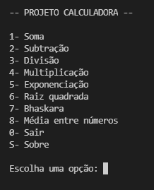
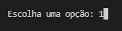
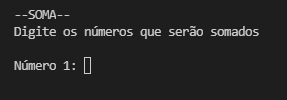
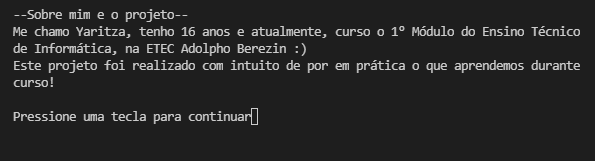
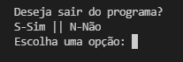

# Calculadora básica

Este programa exibe um menu com opções para cálculos matemáticos básicos. O usuário, ao selecionar uma opção, pode realizar os cálculos e obter os resultados.

## Funções

Realiza cálculos básicos, como:

• Soma
• Subtração
• Divisão
• Multiplicação
• Exponenciação
• Raiz quadrada
• Bhaskara
• Média entre números

## _Exemplos_

• Menu de opções:

• Exemplo de funcionalidade- opção 1:

Selecione a opção desejada e os valores

• Obtenha os resultados e encerre o cálculo:

• Opção: Sobre

Informações sobre o programa ao selecionar -S-

• Saída

Selecione "0" para sair do programa

## Download

[🔽 Baixar o programa](dist/Calculadora.zip)

## Sobre 

Projeto realizado para o componente de Programação de Computadores, ministrado por: [Ermogenes Palácio](https://github.com/ermogenes) e [Diego Neri](https://github.com/diegoneri) do curso de Informática da [ETEC Adolpho Berezin](http://eteab.com.br/cms/).

